# Pong-Bot

A 3-axis stepper-motor ping pong ball launcher controlled by a Raspberry Pi,
with reinforcement learning and computer vision pipelines for autonomous cup aiming.

<p align="center">
  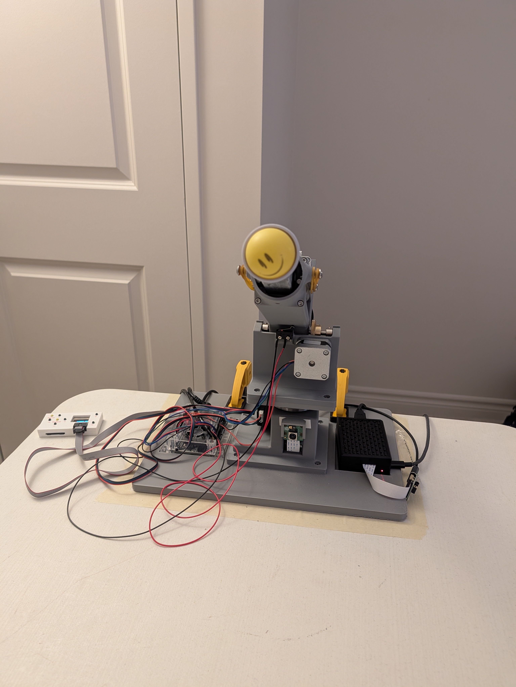
  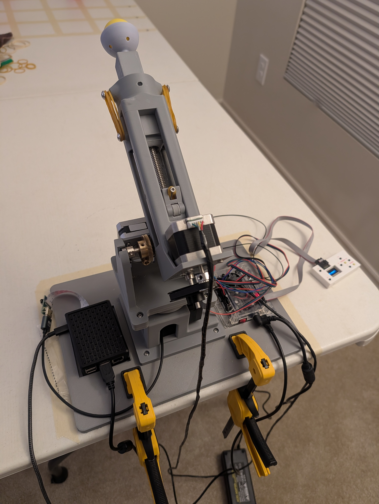
  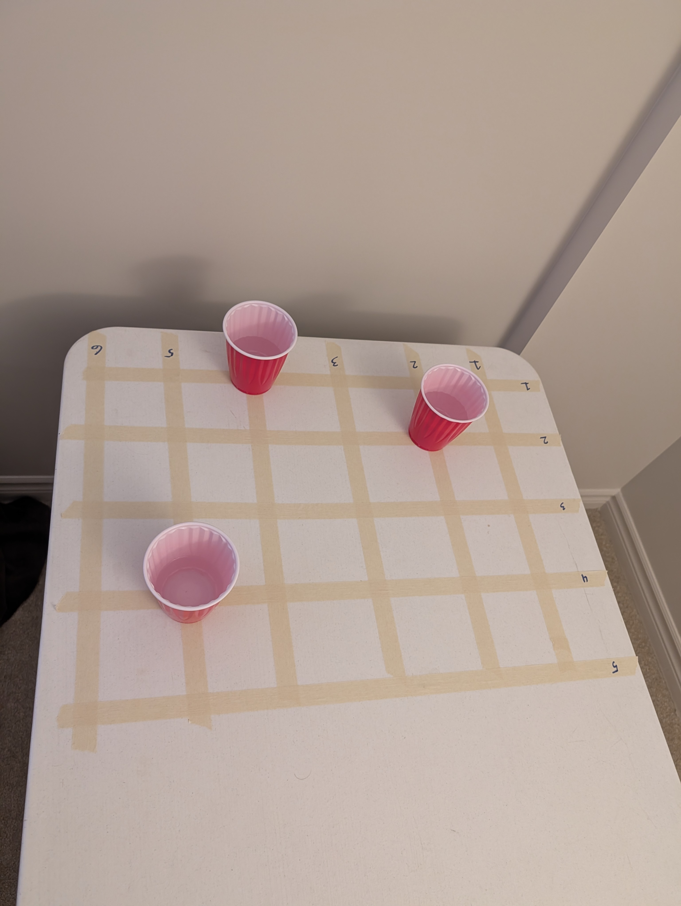
</p>

<p align="center">
  
  
  
</p>

The launcher uses three stepper motors (X pan, Y elevation, Z fire stroke)
controlled by a GRBL-firmware Arduino over serial. A fixed camera on the base
provides visual input for the CV pipeline. The target is a 6x5 grid of 30
labelled cup positions on a table.

## Two Course Projects

| Project | Course | Approach |
|---|---|---|
| Reinforcement Learning | CS4453 | GRU policy trained via BC + REINFORCE using directional hit/miss feedback, no camera at inference |
| Computer Vision | CS4452 | End-to-end detector + aim head predicting motor step targets from a single camera frame |

## Installation

### With Nix (recommended)

```bash
# Raspberry Pi runtime
nix profile install .#pong-bot

# Training server (GPU)
NIXPKGS_ALLOW_UNFREE=1 nix profile install .#training --impure
```

### With pip

```bash
pip install -e .                  # base: motor control + CLI only
pip install -e ".[training]"      # + torch, torchvision, transformers (GPU server)
pip install -e ".[camera]"        # + picamera2 (Raspberry Pi only)
```

## Repository Structure

```
motor_control/   GRBL serial interface and robot control CLI
rl/              GRU policy, BC/REINFORCE training, data collection, evaluation
vision/          PongDetector backbone, V1/V2/V3 aim heads, CV inference pipeline
utils/           Shared path helpers and normalisation constants
data/            JSONL session records (see Data section below)
plots/           Selected result plots and sample inference image
robot/           Hardware photos and demo GIFs
report/          Report latex and pdf files
```

## CS4453 - Reinforcement Learning

A GRU policy learns to locate and score a target cup using only directional
(left/right/short/long) hit/miss feedback. No camera is used at inference time.
An outer GRU policy selects which cup to target next in multi-cup sessions.
The inner policy is trained via behavioural cloning from heuristic demonstrations
followed by REINFORCE fine-tuning.

### Source Files

| File | Description |
|---|---|
| `rl/policy.py` | `HeuristicPolicy`, `GRUPolicy`, `OuterGRUPolicy` |
| `rl/tune.py` | Inner session data collection (single cup) |
| `rl/tune_outer.py` | Multi-cup outer session collection |
| `rl/train.py` | BC, REINFORCE, and outer BC training |
| `rl/eval.py` | Offline simulation evaluation |
| `rl/plots.py` | Analysis plot generation (`pong-plot-rl`) |

### Results

<p align="center">
  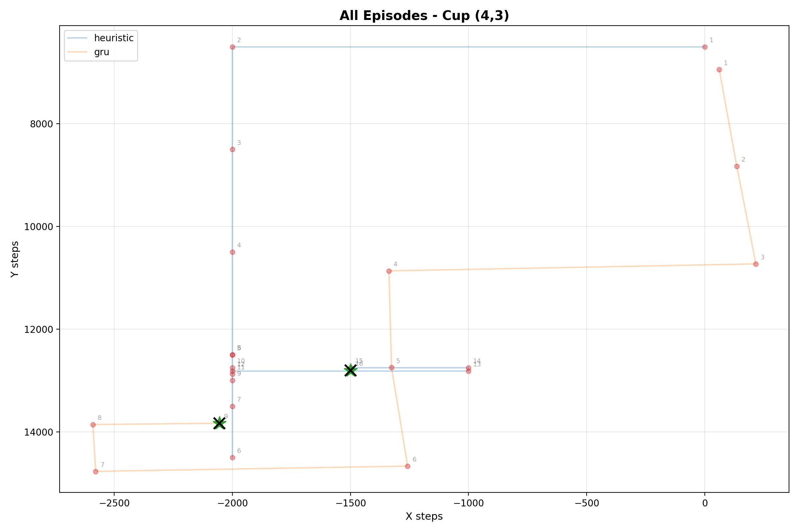
  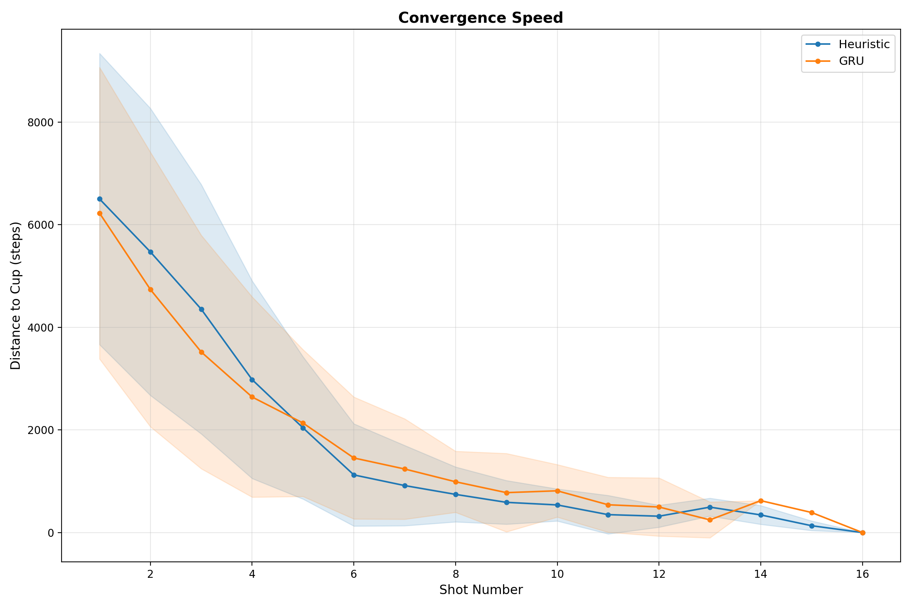
</p>
<p align="center">
  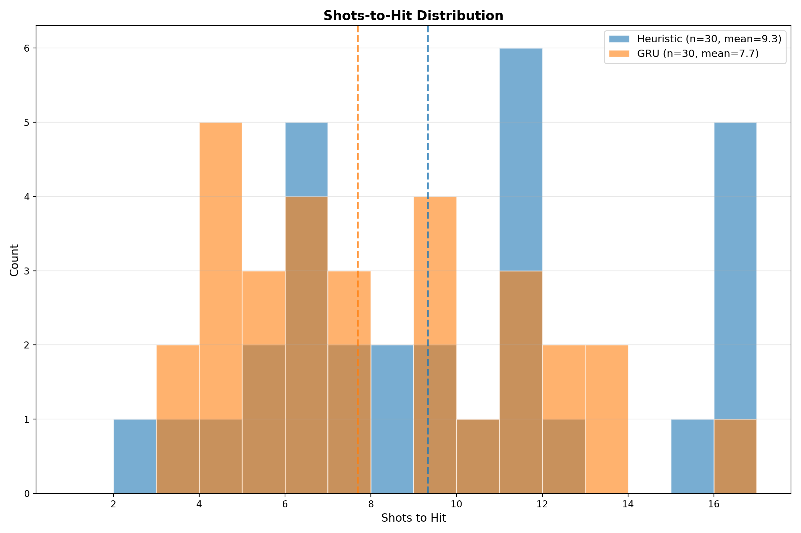
  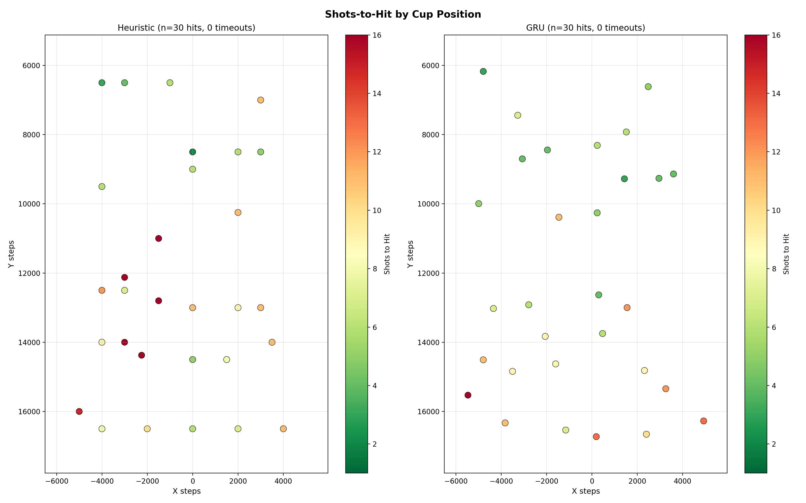
</p>
<p align="center">
  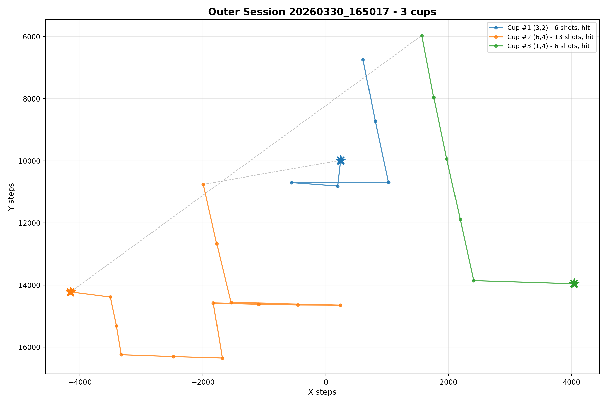
</p>

## CS4452 - Computer Vision

A two-phase pipeline: (1) PongDetector backbone trained with CIoU + focal loss
on a YOLO-style 80x80 grid, then (2) an aim head trained to predict normalised
motor step targets from frozen backbone features concatenated with bounding box
geometry. Three head versions (V1/V2/V3) are compared. The full model is
exported as a single ONNX file and deployed on the Pi via `cv2.dnn`.

### Source Files

| File | Description |
|---|---|
| `vision/models/pong_model.py` | `PongDetector`, `PongAimModelV1/V2/V3` |
| `vision/models/base.py` | `DetectorModel` and `AimModel` abstract base classes |
| `vision/train_detector.py` | Phase 1: backbone training |
| `vision/train_head.py` | Phase 2: aim head training (`--model v1/v2/v3`) |
| `vision/detector.py` | ONNX inference wrapper (`cv2.dnn`, Pi-compatible) |
| `vision/shoot.py` | Pi-side CV inference + shot logging (`pong-cv-shoot`) |

### Results

<p align="center">
  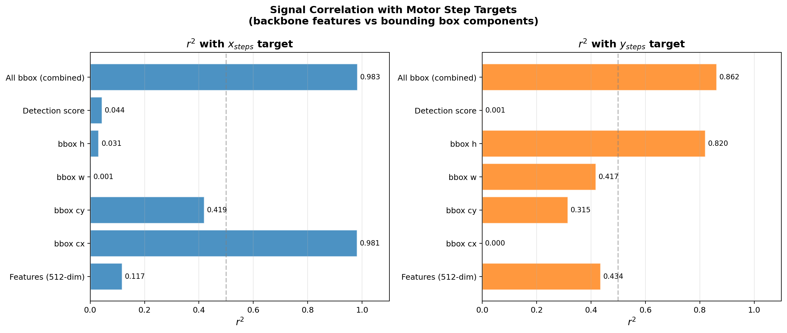
  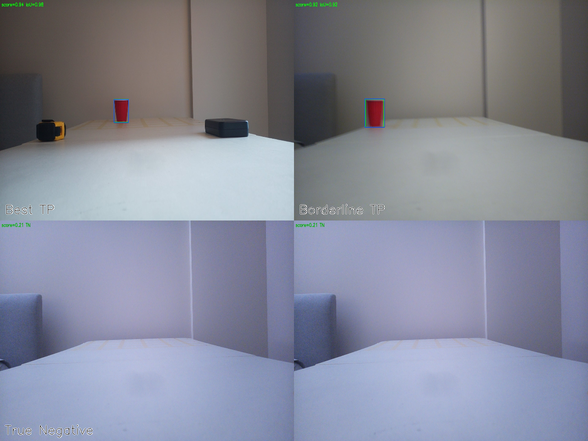
</p>
<p align="center">
  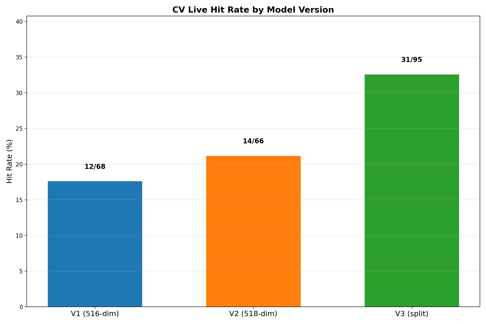
  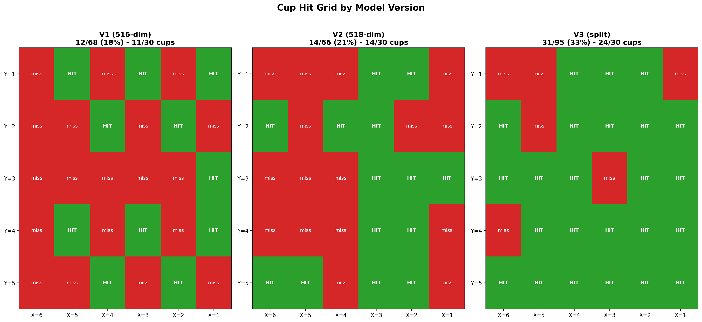
  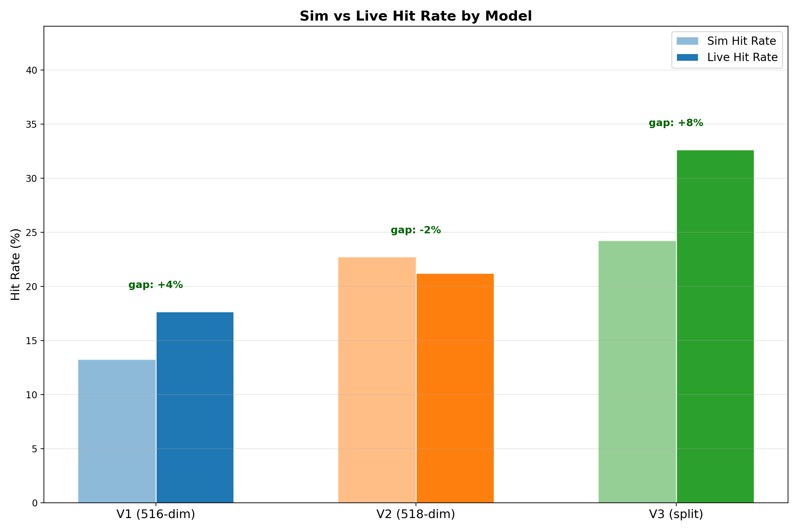
</p>
<p align="center">
  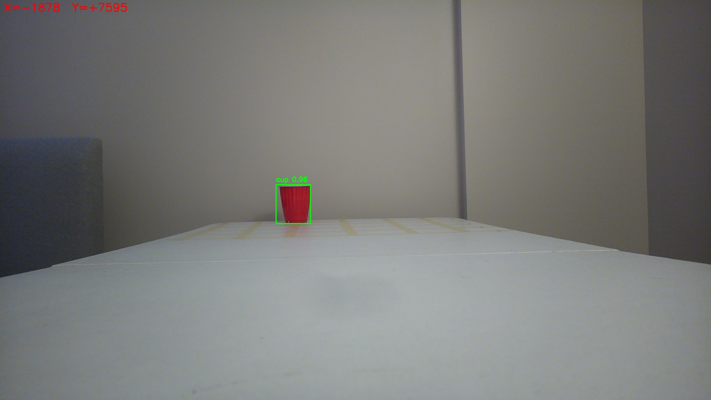
</p>

## Data

```
data/5_elastics/
  rl_shots.jsonl      tracked - all RL session records (inner + outer)
  shots.jsonl         tracked - CV training records (labelled shots)
  cv_shots.jsonl      tracked - live CV evaluation records (V1/V2/V3)
  checkpoints/        gitignored - .pt and .onnx model checkpoints
  train/valid/test/   gitignored - detector training images and YOLO labels
  plots/              gitignored - generated analysis plots
  cv_debug/           gitignored - Pi-side inference debug images
```

Training images, model checkpoints, and generated plots are not committed.
The JSONL files above contain all session and evaluation records and are tracked.
